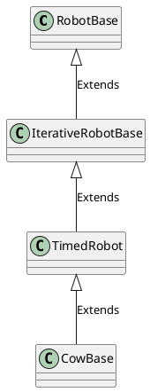

# CowBase Design Document
This document will contain a detailed explanation on `CowBase`, the top-level class that contains each and every software component that is important for the overall function of the `Robot`.  The class heirarchy goes as listed: `RobotBase` is the first abstract class that defines the generic base API of the `Robot`. `IterativeRobotBase` extends `RobotBase` and provides a framework to configure different behaviors of the `Robot` across different iterations or modes. `TimedRobot` extends from `IterativeRobotBase` and provides functionality to make the `Robot` switch between specific modes based on configured timing schedules. Lastly, Team 1538's implementation - the `CowBase` - extends from the `TimedRobot` and details how the robot will operate in which mode and when to switch between them.

