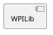

# Holy Cows 2023 Software Architecture
The purpose of this file is to document the overall Software Architecture and Design of the Holy Cows' Robot. The software is built upon the public API provided by WPILib which exposes basic functionality to interface with the various componenents.

