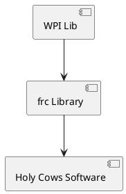

# Holy Cows 2023 Software Architecture
The purpose of this file is to document the overall Software Architecture and Design of the Holy Cows' Robot. 

## WPI Lib
The software is built upon the public API provided by WPILib which exposes various useful base classes to extend from and implement. The WPI Robotics Library (WPILib) is the standard software library provided for teams to write code for their FRC® robots. WPILib contains a set of useful classes and subroutines for interfacing with various parts of the FRC control system (such as sensors, motor controllers, and the driver station), as well as an assortment of other utility functions.

